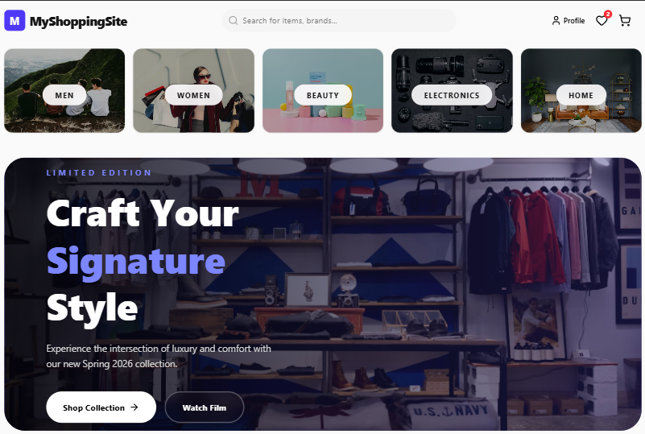
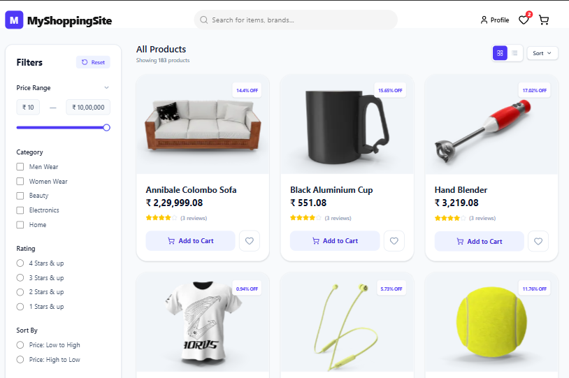
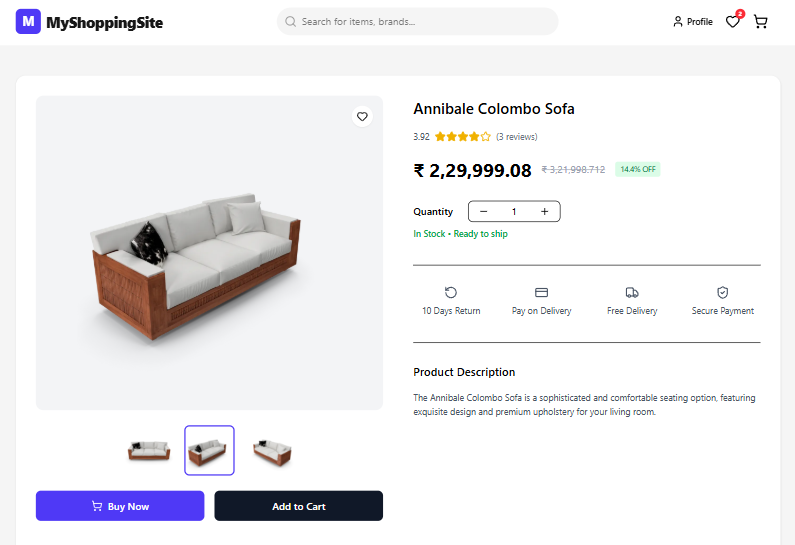
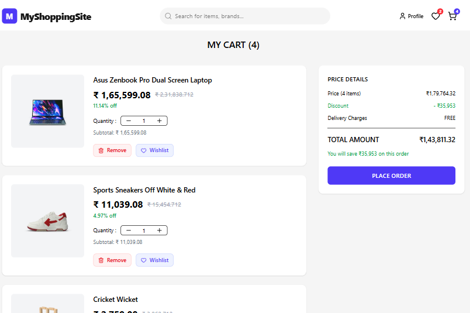
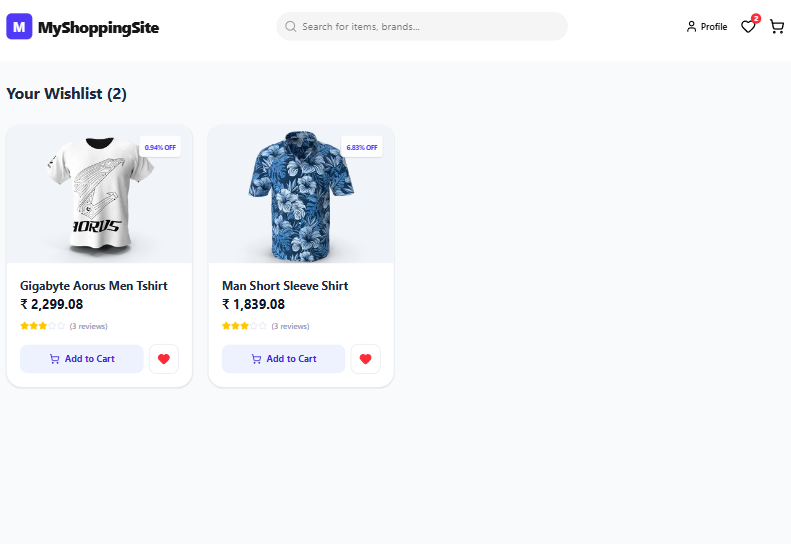
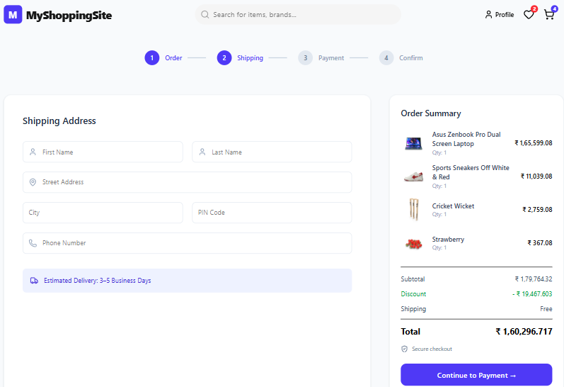
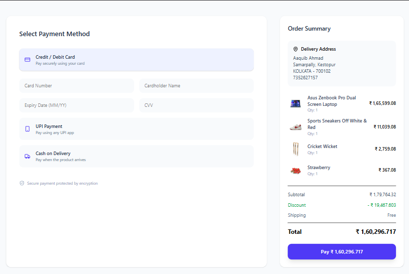
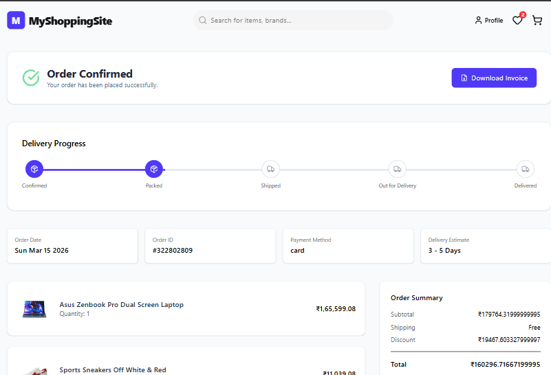
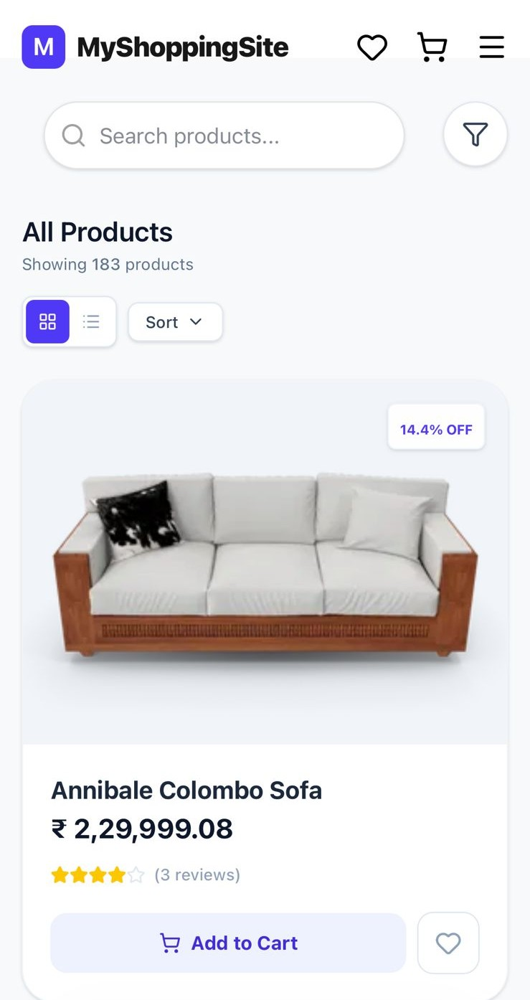

<!-- PROJECT LOGO -->

  

<h1 align="center">MyShoppingSite</h1>

  A Modern Full-Stack E-Commerce Platform Built with React, Node.js and MongoDB

  <a href="https://react-ecommerce-store-58be.vercel.app/"><strong>Live Website »</strong></a>

 

  
  
  
  
  

---

<h2>About The Project</h2>

<strong>MyShoppingSite</strong> is a modern full-stack e-commerce platform designed to replicate the real-world architecture of production online stores.  
The application demonstrates scalable frontend architecture, efficient API integration, and optimized performance using modern web technologies.

The platform provides a complete shopping workflow including product browsing, filtering, wishlist management, cart functionality, shipping flow, payment interface, and order confirmation with invoice generation.

The focus of this project was not only building features but also improving performance, UI/UX, and code architecture similar to production-grade applications.

---

<h2>Project Demo</h2>

<video src="frontend/public/PageImageAndVideo/ProjectVideo.mp4" width="100%" controls></video>

---

<h2>Project Screenshots</h2>

<table>
<tr>
<td></td>
<td></td>
</tr>

<tr>
<td align="center">Homepage</td>
<td align="center">Product Listing</td>
</tr>

<tr>
<td></td>
<td></td>
</tr>

<tr>
<td align="center">Product Details</td>
<td align="center">Cart Page</td>
</tr>

<tr>
<td></td>
<td></td>
</tr>

<tr>
<td align="center">Wishlist</td>
<td align="center">Shipping Page</td>
</tr>

<tr>
<td></td>
<td></td>
</tr>

<tr>
<td align="center">Payment Page</td>
<td align="center">Order Confirmation</td>
</tr>

</table>

---

<h2>Mobile Responsive Design</h2>

---

<h2>Key Features</h2>

<ul>
<li>Product browsing with category filtering</li>
<li>Advanced search functionality with suggestions</li>
<li>Dynamic product detail pages</li>
<li>Cart and wishlist management</li>
<li>Shipping and payment workflow</li>
<li>Order confirmation with invoice download</li>
<li>Skeleton loading UI for better perceived performance</li>
<li>Mobile responsive design</li>
<li>Product sorting (price, rating, discount)</li>
<li>Price range and rating filters</li>
</ul>

---

<h2>Performance Optimizations</h2>

<ul>
<li>Lazy loading for images</li>
<li>Skeleton loading components</li>
<li>Optimized rendering using React hooks</li>
<li>Reduced unnecessary re-renders using useMemo</li>
<li>Efficient filtering and sorting logic</li>
<li>Optimized API calls with custom fetch hooks</li>
<li>Improved user experience through smooth loading transitions</li>
</ul>

---

<h2>Tech Stack</h2>

<h3>Frontend</h3>

<ul>
<li>React</li>
<li>Vite</li>
<li>Tailwind CSS</li>
<li>React Router</li>
<li>Lucide Icons</li>
</ul>

<h3>Backend</h3>

<ul>
<li>Node.js</li>
<li>Express.js</li>
<li>MongoDB</li>
<li>Mongoose</li>
</ul>

<h3>Deployment</h3>

<ul>
<li>Frontend: Vercel</li>
<li>Backend: Render</li>
</ul>

---

<h2>Project Structure</h2>

<pre>
react-ecommerce-store
│
├── backend
│   ├── db
│   ├── models
│   └── index.js
│
├── frontend
│   ├── components
│   ├── pages
│   ├── store
│   ├── utils
│   └── public
│
└── README.md
</pre>

---

<h2>Installation</h2>

<h3>Clone Repository</h3>

<pre>
git clone https://github.com/aaquib132/react-ecommerce-store.git
cd react-ecommerce-store
</pre>

<h3>Backend Setup</h3>

<pre>
cd backend
npm install
npm run dev
</pre>

<h3>Frontend Setup</h3>

<pre>
cd frontend
npm install
npm run dev
</pre>

---

<h2>Environment Variables</h2>

<pre>
VITE_API_URL=http://localhost:3000
</pre>

Production:

<pre>
VITE_API_URL=https://react-ecommerce-api-0gju.onrender.com
</pre>

---

<h2>API Endpoints</h2>

<table>
<tr>
<th>Endpoint</th>
<th>Method</th>
<th>Description</th>
</tr>

<tr>
<td>/products</td>
<td>GET</td>
<td>Fetch all products</td>
</tr>

<tr>
<td>/products/:id</td>
<td>GET</td>
<td>Get product details</td>
</tr>

<tr>
<td>/products/categories/:name</td>
<td>GET</td>
<td>Get products by category</td>
</tr>

</table>

---

<h2>Future Improvements</h2>

<ul>
<li>User authentication system</li>
<li>Secure payment gateway integration</li>
<li>Admin dashboard</li>
<li>Product reviews system</li>
<li>Infinite scroll product loading</li>
<li>Inventory management system</li>
</ul>

---

<h2>Author</h2>

<strong>Aaquib Ahmad</strong> 
Full Stack Developer

---

If you found this project useful, consider giving it a ⭐ on GitHub.

