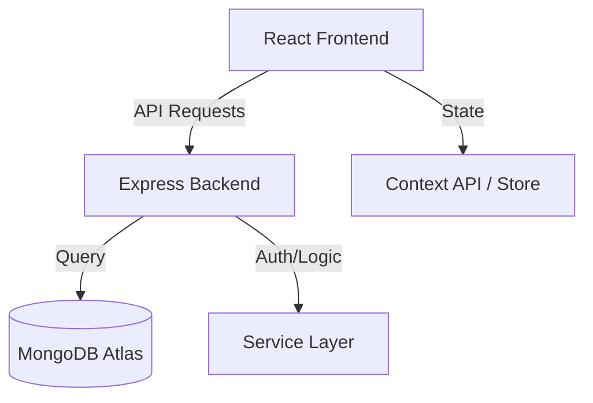

<div align="center">


# 🛒 MyShoppingSite
**The Ultimate Modern Full-Stack E-Commerce Experience**

[](https://react-ecommerce-store-58be.vercel.app/)
[](https://opensource.org/licenses/MIT)
[](#)


</div>

---

## 📖 Table of Contents
- [Overview](#-overview)
- [Tech Stack](#-tech-stack)
- [Key Features](#-key-features)
- [Architecture](#-architecture)
- [Installation](#-installation)
- [Gallery](#-project-gallery)

---

## 🧐 Overview
**MyShoppingSite** is a production-grade e-commerce solution built with the MERN stack. It bridges the gap between high-performance UI and scalable backend architecture, offering users a seamless shopping journey from discovery to checkout.

> **Why this project?** To demonstrate how modern engineering patterns like **Lazy Loading**, **Memoization**, and **RESTful API design** can be combined to create a lightning-fast user experience.

---

## 🛠 Tech Stack

### **Frontend**


### **Backend & Database**


---

## ✨ Key Features

| Feature | Description |
| :--- | :--- |
| **🔍 Smart Search** | Advanced search suggestions and filtering by price/rating. |
| **⚡ Performance** | Skeleton screens and image lazy-loading for 0.5s perceived load time. |
| **📱 Responsive** | Mobile-first design with a dedicated custom search & filter UI. |
| **🛒 Cart System** | Real-time state management for cart, wishlist, and shipping logic. |

---

## 🎥 Demo Video
<div align="center">
  <a href="frontend/public/PageImageAndVideo/ProjectVideo.mp4">
    
  </a>
  <p><i>Click the image above to watch the walkthrough video</i></p>
</div>

---

## 🖼 Project Gallery

<table style="width: 100%;">
  <tr>
    <td width="50%"><br/><b>🏠 Homepage</b></td>
    <td width="50%"><br/><b>📦 Product Listing</b></td>
  </tr>
  <tr>
    <td width="50%"><br/><b>🛒 Cart System</b></td>
    <td width="50%"><br/><b>📱 Mobile Experience</b></td>
  </tr>
</table>

---

## 🏗 Architecture


---
<details>
<summary>📂 <b>View Project Structure</b></summary>

```text
react-ecommerce-store
├── backend
│   ├── db         # Connection logic
│   ├── models     # Mongoose Schemas
│   └── index.js   # Entry point
├── frontend
│   ├── components # Reusable UI
│   ├── pages      # Route components
│   ├── store      # State management
│   └── src        # Main logic
└── README.md

```
</details>

---

### ⚙️ Quick Start

### 1. Clone & Install
```bash
git clone [https://github.com/aaquib132/react-ecommerce-store.git](https://github.com/aaquib132/react-ecommerce-store.git)
cd react-ecommerce-store
```

### 2. Environment Setup

Create a `.env` file in the **frontend** directory and add the following:

```env
VITE_API_URL=http://localhost:3000
```

### 3. Run Locally
Backend:

```Bash
cd backend && npm install && npm run dev
```
Frontend:

```Bash
cd frontend && npm install && npm run dev
```

---

## 📡 API Reference

| Method | Endpoint | Description |
| :--- | :--- | :--- |
| **GET** | `/products` | Fetch all available products |
| **GET** | `/products/:id` | Get individual product details |
| **GET** | `/categories` | List all product categories |

---

---

## 👨‍💻 Author

**Aaquib Ahmad** *Full Stack Developer*

<div align="center">

---

⭐ **If you found this project helpful, please give it a star!**

</div>
