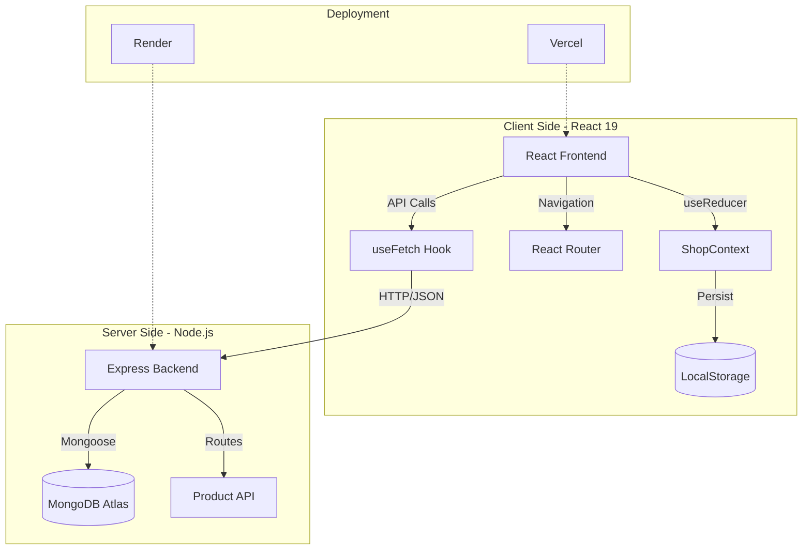

<div align="center">


# 🛒 MyShoppingSite
**The Ultimate Modern Full-Stack E-Commerce Experience**

[](https://react-ecommerce-store-58be.vercel.app/)
[](https://opensource.org/licenses/MIT)
[](#)


</div>

---

## 📖 Table of Contents

- [Overview](#overview)
- [Tech Stack](#tech-stack)
- [Key Features](#key-features)
- [Project Gallery](#project-gallery)
- [Architecture](#architecture)
- [Project Structure](#-project-structure)
- [Installation](#installation)
- [API Reference](#-api-reference)

---

## 🧐 Overview
**MyShoppingSite** is a production-grade e-commerce solution built with the MERN stack. It bridges the gap between high-performance UI and scalable backend architecture, offering users a seamless shopping journey from discovery to checkout.

> **Why this project?** To demonstrate how modern engineering patterns like **Lazy Loading**, **Context API State Persistence**, and **RESTful API design** can be combined to create a lightning-fast and reliable user experience.

---

## 🛠 Tech Stack

### **Frontend**


### **Backend & Database**


---

## ✨ Key Features

| Feature | Description |
| :--- | :--- |
| **🔍 Smart Search** | Real-time product filtering and categorization. |
| **⚡ Performance** | Skeleton loaders and route-based code splitting (Lazy Loading). |
| **📱 Responsive** | Mobile-optimized navigation and touch-friendly interactive elements. |
| **🛒 Persistence** | Shopping cart and wishlist state preserved via `localStorage`. |
| **💳 Smooth Checkout** | Multi-step shipping and payment flow with order confirmation. |

---

## 🎥 Demo Video

<div align="center">

<a href="frontend/public/PageImageAndVideo/ProjectVideo.mp4">

</a>

<p><i>Click the image above to watch the walkthrough video (Requires GitHub access)</i></p>

</div>

---

## 🖼 Project Gallery

<table style="width:100%;">
<tr>
<td width="50%" align="center">
<br/>
<b>🏠 Homepage</b>
</td>
<td width="50%" align="center">
<br/>
<b>📦 Product Listing</b>
</td>
</tr>
<tr>
<td width="50%" align="center">
<br/>
<b>🔍 Product Details</b>
</td>
<td width="50%" align="center">
<br/>
<b>🛒 Cart Page</b>
</td>
</tr>
<tr>
<td width="50%" align="center">
<br/>
<b>❤️ Wishlist</b>
</td>
<td width="50%" align="center">
<br/>
<b>🚚 Shipping Page</b>
</td>
</tr>
<tr>
<td width="50%" align="center">
<br/>
<b>💳 Payment Page</b>
</td>
<td width="50%" align="center">
<br/>
<b>✅ Order Confirmation</b>
</td>
</tr>
</table>

---

## 📱 Mobile Responsive Design

<div align="center">


<p><i>Optimized for mobile with a custom bottom navigation and search UI.</i></p>

</div>

---

## 🏗 Architecture

The project follows a **decoupled MERN architecture**, allowing the React client and Express server to scale independently.

### 🧩 System Design



---

<details>
<summary>📂 <b>View Project Structure</b></summary>

```text
react-ecommerce-store
├── backend
│   ├── db/         # MongoDB connection (Mongoose)
│   ├── models/     # Product/User Schemas
│   └── index.js    # Express entry point & REST routes
├── frontend
│   ├── src
│   │   ├── components/ # Reusable UI (Navbar, Skeletons)
│   │   ├── pages/      # Route-level components
│   │   ├── store/      # Global state (Context + useReducer)
│   │   ├── utils/      # Helper functions
│   │   └── useFetch.jsx# Custom data fetching hook
│   ├── public/     # Static assets & readme media
│   └── package.json
└── README.md
```
</details>

---

## ⚙️ Installation

### 1. Clone & Install
```bash
git clone https://github.com/aaquib132/react-ecommerce-store.git
cd react-ecommerce-store
```

### 2. Environment Setup
Create a `.env` file in the **frontend** directory:
```env
VITE_API_URL=http://localhost:3000
```

### 3. Run Locally

**Backend:**
```bash
cd backend
npm install
npm run dev
```

**Frontend:**
```bash
cd frontend
npm install
npm run dev
```

---

## 📡 API Reference

| Method | Endpoint | Description |
| :--- | :--- | :--- |
| **GET** | `/products` | Fetch all products |
| **GET** | `/products/:productId` | Fetch single product details |
| **GET** | `/products/categories/:categoriesName` | Filter products by category |
| **GET** | `/products/categories/:categoriesName/:productId` | Fetch specific item in category |

---

## 👨‍💻 Author

**Aaquib Ahmad**  
*Full Stack Developer*

---
<div align="center">
⭐ <b>If you found this project helpful, please give it a star!</b>
</div>
